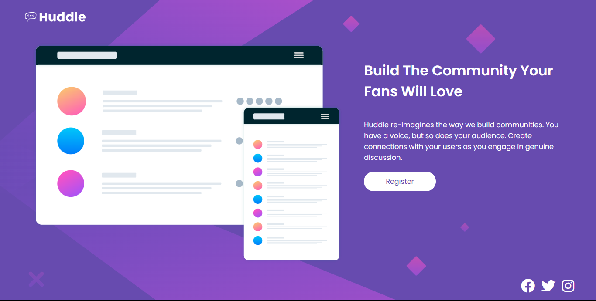
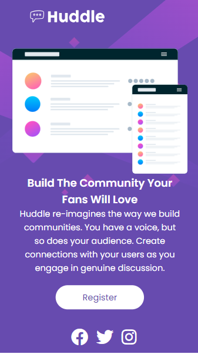

# Solução para quest Huddle landing page com seção introdutória única usado pelo curso Devquest


Esta é uma solução para o [desafio da Huddle com seção introdutória única no Frontend Mentor](https://www.frontendmentor.io/challenges/huddle-landing-page-with-a-single-introductory-section-B_2Wvxgi0). Desafio feito pelo curso Devquest para testar as habilidades de HTML5 e CSS do aluno.

## Índice

- [Visão geral](#visão-geral)
   - [O desafio](#o-desafio)
   - [Captura de tela](#captura-de-tela)
   - [Links](#links)
- [Meu processo](#meu-processo)
   - [Construído com](#construído-com)
   - [O que aprendi](#o-que-aprendi)
   - [Desenvolvimento contínuo](#desenvolvimento-contínuo)
   - [Recursos úteis](#useful-resources)
- [Autor](#autor)
- [Agradecimentos](#agradecimentos)

**Observação: exclua esta nota e atualize o índice com base nas seções que você mantém.**

## Visão geral

### O desafio

Os usuários devem ser capazes de:

- Ver o layout ideal da página dependendo do tamanho da tela do dispositivo
- Ver os estados de foco para todos os elementos interativos na página

### Capturas de tela




### Links

- URL da solução: [CLIQUE AQUI](https://lucas-madeira78.github.io/Projetos-e-quests/)

## Meu processo

### Construído com

- Marcação HTML5 semântica
- Propriedades personalizadas CSS
- Flexbox
- Fluxo de trabalho voltado para dispositivos móveis

### O que eu aprendi

* Criar DIVs de forma semantica para ter um código organizado e fácil de ler.
* Utilizar flexbox para centralizar e flexibilizar os elementos.
* Utilizar @media para tornar o site responsivo.

```html
<div class="container">

  

    <div class="info">

      <h1 class="text">Build The Community Your Fans Will Love</h1>

      <p class="text">Huddle re-imagines the way we build communities. You have a voice, but so does your audience. 
      Create connections with your users as you engage in genuine discussion.</p>

      <a class="button" href="#">Register</a>
    </div>

</div>
```
```css
.content {
    display: flex;
    flex-direction: column;
    justify-content: space-around;
    align-items: center;
}
```
```css
@media (max-width: 1000px) {
    body {
        background-image: url(images/bg-mobile.svg);
        background-size: cover;
    }
}
```

### Desenvolvimento contínuo

Desejo me aperfeiçoar na aprendizagem de flexbox e a organização das tags HTML a fim de melhorar meu código e estilização, assim como me aprofundar na linguagem Javascript e tornar meus projetos mais dinâmicos.

### Recursos úteis

- [Font Awesome](https://fontawesome.com) - Me ajudou a encontrar e estilizar de forma prática os ícones que desejei.
